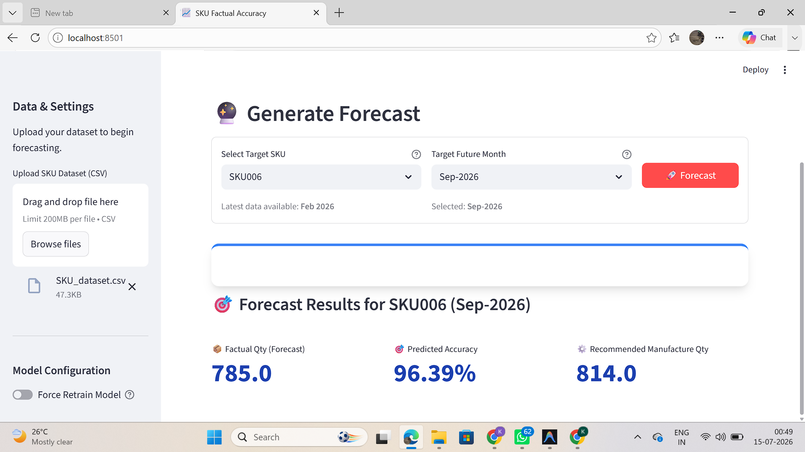

# SKU Manufacture & Accuracy Forecaster

An interactive AI web application built with Streamlit and TensorFlow/Keras. This application uses a Long Short-Term Memory (LSTM) Neural Network to generate future manufacturing quantity and accuracy forecasts based on historical SKU data.

## Features
- **Upload Dataset**: Direct CSV upload capability from the UI.
- **Dynamic Training**: Automatically trains a tailored LSTM model on the provided dataset.
- **Intelligent Forecasting**: Generates multi-step future forecasts for any specific SKU up to any target month.
- **Premium UI**: Clean, responsive, and visually appealing interface built with Streamlit and custom CSS.

## Getting Started

### Prerequisites
Make sure you have Python installed, then install the required dependencies:

```bash
pip install -r requirements.txt
```

### Running the Application

To launch the Streamlit server, run the following command in the root directory:

```bash
python -m streamlit run app.py
```

Then, open your web browser and navigate to `http://localhost:8501`.

## Usage
1. Open the app in your browser.
2. Expand the sidebar and upload your historical `SKU_dataset.csv`.
3. Wait for the model to initialize and train.
4. Select a specific SKU from the dropdown menu.
5. Enter a target future month (e.g., `Jun-2026`).
6. Click **Forecast** to see the AI's predicted metrics!

## Project Structure
- `app.py`: The main Streamlit web application and UI layout.
- `model_utils.py`: Contains all the machine learning logic, data processing, and LSTM model architecture.
- `requirements.txt`: Python package dependencies.

## Understanding the Forecast Output



When you generate a forecast for a specific SKU and target month, the AI provides three key metrics:

1. **📦 Factual Qty (Forecast)**: This represents predicted real-world demand or "sold" quantity for that specific future month. It uses historical growth patterns to estimate how many units will actually be needed by customers.
2. **🎯 Predicted Accuracy**: This percentage indicates the expected manufacturing accuracy or yield for that month, based on historical accuracy trends (Actual Produced vs. Factual Sold) for this specific SKU.
3. **⚙️ Recommended Manufacture Qty**: This is the final, mathematically adjusted quantity you should actually produce. It is calculated by taking the *Factual Qty (Forecast)* and dividing it by the *Predicted Accuracy*. For example, if you expect to sell 785 units but historically only have a 96.39% accuracy yield, you must manufacture ~814 units to safely meet the demand.
